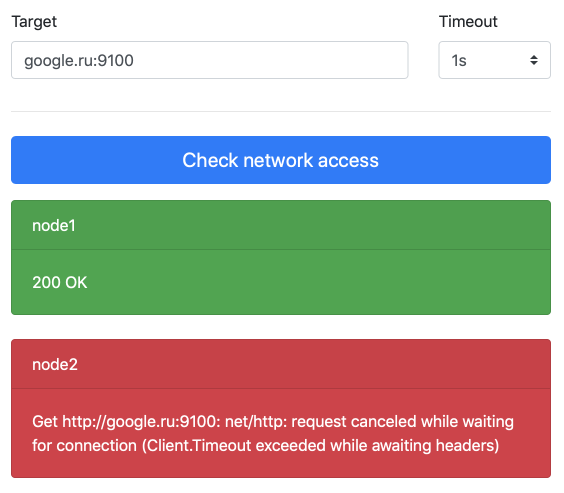

:point_up: Данный репозиторий представляет собой копию проекта `prometheus-network-check`, скачанного из вебархива https://web.archive.org/web/20210117101937/https://github.com/leominov/prometheus-network-check. Версия приложения v1.2.1.

## Сборка

```bash
make build # выдаст ошибку при сборке
go build -o prometheus-network-check
```

## Запуск

```bash
./prometheus-network-check # запуск с дефолтными параметрами
# запуск с указанием нескольких хостов
./prometheus-network-check -prometheus.aliases="node1,node2,node3" \
  -prometheus.nodes="http://node1:8010,http://node2:8010,http://node3:8010" \
  -web.target-input-value="https://yandex.ru"
```

Веб-интерфейс доступен по адресу: `http://127.0.0.1:8010/network-check`

Метрики доступны по адресу: `http://127.0.0.1:8010/metrics`

:point_down: Далее содержание оригинального `README.md`.


# Prometheus Network Check

## Interface



## Metrics

* [prometheus/client_golang](https://github.com/prometheus/client_golang) metrics
* `prometheus_network_check_failure_count`
* `prometheus_network_check_success_count`

## Usage

```
Usage of /prometheus-network-check:
  -prometheus.aliases string
    	Comma-separated list of Prometheus aliases (node1,node2) (default "node1")
  -prometheus.nodes string
    	Comma-separated list of Prometheus addresses (http://host1:8010,http://host2:8010) (default "http://127.0.0.1:8010")
  -timeout.max duration
    	Maximal allowed timeout for access requests (default 30s)
  -timeout.min duration
    	Minimal allowed timeout for access requests (default 1s)
  -version
    	Prints version and exit
  -web.listen-address string
    	Listen address (default "0.0.0.0:8010")
  -web.path string
    	Web interface path (default "/network-check")
  -web.target-input-placeholder string
    	Placeholder for input in web interface (default "localhost:9100")
  -web.target-input-value string
    	Default value for target input in web interface (default "google.ru:80")
  -web.target-scheme string
    	Default scheme for targets if not specified (default "http")
  -web.telemetry-path string
    	Path under which to expose metrics; Empty string to disable (default "/metrics")
```

Works well with only redefined `prometheus.aliases` and `prometheus.nodes` flags.
